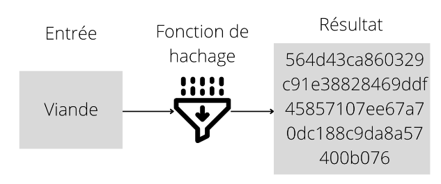

https://www.coindesk.com/markets/2022/11/07/how-digital-assets-get-into-investable-indices/

https://www.canva.com/design/DAFR7e4IK7I/Xf5lbiKfitnHkehm--rF_w/edit#
Voir Binance academy y'a des pépites

## Organisation

| Temps    | Sujets                      |
| -------- | --------------------------- |
| 25 min   | Révision période précédente |
| 5 min    | Pause Random                |
| 25 min   | Cours                       |
| 5 min    | Pause                       |
| 0-25 min | Q&A                         |
| 5-10 min | Contrôle                    |
| 5 min    | Présenter le prochain TD    |

## Cours

- Cryptomonnaies
  - Création d'une crypto
  - Volatilité
  - Sécurité
    - Les risques
    - Comment s'en protéger
  - Le halving du BTC

---

# Comment créer une crytomonnaie

## Son utilité

Chaque crypto à son propre objectifs, certaines sont liées à des jeux, d'autres résolvent certain problèmes technologies, pour des échanges ou d'autres ne servent à rien.

Pour la création d'une crypto, il faut d'abord savoir à quoi elle va servir, par exemple dans le cas de notre cryptomonnaie l'ApsioCoin, on a d'abord inventé le concet de rémunérer des étudiants avant d'aller plus loin.

## La création de la crypto

Etre présent sur un exchangen des gens cherchent des cryptos avec un fort potentiel => permet de faire entrer sur le marché de nouvelles cryptos sur des sites du type : #exemple

## Le livre blanc ( whitepaper )

Les cryptos n'ont pas toute la meme utilité, certaines sont faites pour les echanges, d'autres resolvent des problemes techniques, d'autres sont liés à des jeux vidéo, et certaines de servent a rien (DODGE COIN, SHIBA INU).

Tout ceci est décris dans un livre blanc (white paper) qui explique pourquoi cette crypromonnaie existe.

### Permet de promouvoir

Il est aussi utilisé pour promouvoir sa crypto pour attirer les investisseurs pendant des levées de fonds.

### Pour présenter sa crypto

BTC fait 8 pages et résume son utilité et son fonctionnement.
Il présente aussi ses caractéristiques techniques, comme son type de concensus (PoW).
En plus de cela, il anticipe les problèmes à venir et décrit les règles à suivre en cas de conflits.

### Avertissement

Il n'est néanmoins pas un gage de qualité car il n'est pas obligatoire et la blockchain peut evoluer sans pour autant mettre a jour le white paper.
Exemple d'évolution de blockchain : ETH passe en PoS.

# Le marché de la cryptomonnaie

## La loi de l'offre et la demande

Contrairement au monnaies fiat (euro, dollars, etc..), les cryptomonnaies sont seulement régies par l'offre et la demande.

Les action sont valuées en fonction de la perf de l'entreprise, les crypto n'ont pas de valeur intrinsèques et leurs cours et régie par le niveau de spéculation.

## Pas de regulation

> "_Sur le marché boursier, il faut savoir que **Wall Street suspend les échanges** dès que le marché perd plus de 7 %. De plus, lorsque les marchés s’écroulent, **la finance met sous pression les banques centrales pour qu’elles mettent en place des plans de relance**. Ces mécanismes existent justement pour éviter une trop grande volatilité à la baisse des monnaies fiat et écarter les cracks boursiers._"

- #Cryptonaute, [[https://cryptonaute.fr/volatilite-des-cryptomonnaies-pourquoi-et-comment-en-profiter/]]

Ce n'est pas le cas des cryptomonnaies, le marché est ouvert h24, et si on regarde les courbes, on peut voir que faire -7% est assez commun

Btc 40% de tout donc quand elle monte les autres aussi (en gros).

## Le halving du btc

### Qu'est ce que c'est

Division en 2 des récompenses des mineurs.
Ca à été fixé dès le debut par l créateur du btc.

### Pourquoi ?

Cela permet de créer de la rareté, contrairement à l'euro ou le dolars il y a un nombre limité de BTC (21 millions en circulatio). C'est cette limite qui en fait une denrée rare, comme l'or.
90% des BTC sont déjà en circulation et une fois cette limite atteinte il n'y en aura plus jamais de nouveau minés.
Cette limite renforce le fait que cette denrée rare peut s'épuiser et gagner en rareté, donc en valeur.

Le halfing est là pour retarder cette limite.
En effet si tous les mineurs seraient restés à 50 BTC par bloc il n'y en aurai déjà plus
Il à été calculé que la limite sera atteinte en 2140.

Dès lors que la limite sera atteinte on ne sait pas ce qui se passera, mais la solution envisagée est de remunerer les mineurs avec des frais de maintenances.

### Pourquoi 21 Millions ?

Il y a 2 suppositions :

1. à l'époque il y avait 21 trilliards de dollars, donc Satoshi Nakamoto s'est dit que si le BTC deviens une minnaie courante, il vaudrait 1 millions de dollars.
2. Une question de commodité pour répondre à une logique mathématique.

### Quand ?

En pratique le halfing se passe tous les 210 000 blocs, étant donné qu'un bloc se mine en 10 minutes, on peut en déduire que le halfing se passe toutes les 3.995 années.

| Année                     | 2008 | 2012 | 2016 | 2020 | 2024  |
| ------------------------- | ---- | ---- | ---- | ---- | ----- |
| Gain en BTC par bloc miné | 50   | 25   | 12.5 | 6.25 | 3.125 |
|                           |      |      |      |      |

### Les conséquences

Des hausses importantes mais pas nécessairement dessuite. Cette hausse est logique. Effectivement il devient de plus en plus rare car moins produit, ce qui est rare est cher.
Comme vu précédemment, quand le BTC augmente la majorité augmente, donc les autres cryptos auront aussi tendance à exploser.
Il y aura un effet boule de neige car de nombreuses personnes en parleront et influencerons les autres.

# Décentralisation

Se base sur une blockchain :
![[infog-block-chain.jpg]]
`economie.gouv.fr`

1. Lorsque bob veut envoyer de l'argent à alice, il passe par une banque qui valide la transaction et sert de référence en cas de litige.
2. Avec un réseau décentralisé ce sont les particuliers (les mineurs) qui vont tous se mettre d'accord sur le fait qu'alice envoie tel montant à bob. Ainsi chacun à un registre valide, et même si un malin essaye de le traffiquer, les autres n'auront pas le même et ma transaction ne sera pas valide.

Décentraliser permet donc de savoir qui a envoyer quoi et a qui et de se passer d'une entité souverraine.

# Sécurité

## Cryptographie

On appelle ca une **crypto**monnaie car elle repose sur des principes cryptographiques.

### La fonction de hachage

Une fonction de hachage tient son nom de hash en anglais qui signifie :

- Le désordre.
- Découper en pièces qui fait référence à la cuisine, hacher de la viande par exemple.

Dans l’exemple ci-dessus nous avons passé le mot viande dans une fonction de hachage qui s’appelle sha256 pour obtenir un “steak haché” informatique appelé hash.

Dans le cadre informatique, cela nous permet par exemple de chiffrer une chaîne de caractères.

### Le hash

Un hash est le résultat d’une fonction de hachage. La fonction de hachage va prendre n’importe quel contenu informatique et retourner en sortie un hash de longueur finie. La comparaison souvent faite est que le hash est comparable à une empreinte : si on change une portion même petite du document initial le hash change.

Aujourd’hui, il existe un grand nombre de fonctions de hachage, les plus utilisées sont celles de la série SHA-2 créé par la NSA. Dans la plupart des crypto-monnaies d’aujourd’hui, c’est le sha-256. Je vais donc revenir sur les grands principes d’une bonne fonction de hachage.

Voici les propriétés principales que doit avoir une fonction de hachage cryptographique :

#### A sens unique

Les fonctions de hachage sont à sens unique c’est à dire qu’à partir du résultat il est impossible de trouver le message d’origine. C’est facilement explicable par le fait qu’un hash a une longueur constante, tandis que le message, lui, peut avoir une longueur variable. Ainsi, pour trouver le message d’origine d’un hash, il faut tester toutes les longueurs de messages possibles en plus de tester toutes les combinaisons pour chaque longueur de message.

#### Aucun doublons (ou presque)

Comme la fonction de hachage renvoie une chaîne de caractères à longueur finie, il est évident que pour deux messages différents la fonction va renvoyer le même message, c’est ce qu’on appelle une collision. Une bonne fonction de hachage limite ce nombre de collisions. Si une fonction de hachage a des collisions trop faciles ou trop fréquentes, des algorithmes performants basés sur ces collisions peuvent être élaborés et rendre la fonction de hachage obsolète, comme par exemple, avec les cas sha1 et MD5.

#### Imprévisible grâce à l’effet avalanche

Une fonction de hachage doit à partir de légères modifications apportées au message d’origine modifier considérablement la valeur de hachage résultante, afin qu’elle apparaisse non corrélée avec le message d’origine.
Ainsi est appelé l’effet avalanche d’une fonction de hachage le concept suivant :
Si on modifie un bit du message originel, ce dernier bit impactera la modification d’autres bits qui impacteront la modification d’autres bits de manière la plus chaotique possible pour que la fonction soit imprévisible. Ainsi, comme une petite secousse sur un point haut d’une montagne peut provoquer une avalanche, une petite modification du message source entraînera un hash totalement différent.

## Le chiffrement asymétrique et son application dans la cryptomonnaie

Lorsqu’on veut chiffrer une donnée, on va la plupart du temps devoir faire le choix entre deux types de chiffrement selon les cas d’usages. Ces chiffrements sont :

### Qu'est-ce que le chiffrement symétrique ?

Le chiffrement dit symétrique dans lequel deux utilisateurs se partagent une clé et s’en servent pour chiffrer et déchiffrer les messages. Le principal avantage de ce système est qu’il est beaucoup plus rapide pour le chiffrement et le déchiffrement que celui dit asymétrique.

### Qu'est-ce que le chiffrement asymétrique ?

Le chiffrement dit asymétrique dans lequel deux utilisateurs ont chacun deux clés, une dite publique et l’autre privée. L’utilisateur A va passer sa clé publique à l’utilisateur B puis va chiffrer son message avec sa clé privée. L’utilisateur B pourra lire le message en déchiffrant le message avec la clé publique de l’utilisateur.

### Pourquoi on utilise des chiffrements asymétriques ?

### Son application dans la cryptomonnaie

-> à quoi une clé privé ?
-> à quoi ressemble une clé publique ?
-> qu'est-ce que seed phrase ?

## Les risques

### Les transactions

Si on fait un virement a un mauvais RIB, le virement n'est pas declenché car il n'existe pas.
Or pour les cryptos c'est le contraire, chaque addresses (elles s'apparentent a des Ribs) existe déjà. Donc si une transaction est faite sur une mauvaise addresse, la somme est perdue à jamais.

### Prix fluctuant dans les 2 sens

On entends souvent dire qu'il possible de devenir millionaire rapidement en investissant des les crypros.
Effectivement quand on regarde la courbe, nos yeux sont fixés sur l'enorme pic entre juillet 2020 et juin 2021 et on se dit "Ah si j'avais su".

![[Screenshot_20221026_125251.jpg]]
En effet si j'avais acheté 10 000€ de BTC en juin 2020 et que je vendais tous 1 an après j'aurai gagné 50 000€ sans rien faire.

Or la vie n'est pas si belle. Il faut se rappeller que si on peut vite gagner, on peut aussi vite perdre.

Prenons un exemple du 11/2021 au 11/2022 de 70 000$ à 20 000$.

Donc possibilité de perdre plus de la moitié de ses actifs très rapidemment.

### Les arnaques

Des mails frauduleux se faisant passer pour votre plateforme d'echange favorite (fishing).

### Les hacks

Plus il y a à gagner, plus les hackeurs investissent du temps et de l'argent pour accéder à leur butin.

Un hackeur à réussi à récupérer le numéro de téléphone d'une baleine et à appeller son FAI. La personne au bout du fil n'a pas bien fait son travail et à seulement demander son adresse mail, sa date de naissance... des info assez peut privées.
Le FAI à donc fait confiance au hackeur qui à demandé d'envoyer une nouvelle carte SIM. Il a pu changer tous les mot de passes de la victime et a pu récuperer toutes ses crypto. Depuis des mesures ont été mises en place mais c'est un exemole pour montrer qu'il peut y avoir des failles.

Il y a eu d'autres hacks dans le passé et le plus récent connu date du 7 octobre 2022 et est un vol d'un million de BNB, ce qui correspond à plus de 100 millions de $.

Lorsque des hacks comme celui ci se produisent, les plateformes d'echanges comme Binance ou Crypto.com ont une assurance pour rembourser les utilisateurs qui ont été volés. Néanmoins il n'est obligatoire de se faire rembourser.
Le cours de la crypto en question chute aussi (-4% dans le cas du BNB).

# Questions réponses

# Cryptomonnaies et fiscalité

Flat taxe

Qu'est-ce que la DEFI
Source : Youtube - BIS

Decentralized Finance (DeFi) employs public Blockchain networks andsmart contracts to build open, transparent, composable and non-custodial financial protocols.

Open: Open to anyone, no access restrictions, no boss.
Transparent: Mathematically verifiable by anyone. Data availability.
Composable: Interoperable lego pieces.

La construction de la DEFI
Source : Fabian Schär - Decentralized Finance: On Blockchain- and Smart Contract-Based Financial Markets

Exemple avec la Blockchain Ethereum, qui a le plus de transactions DEFI.
Pasted image 20221105114840.png

Chaque layer est au maximum aussi sécurisé que celui qui est en dessous de lui. Ainsi il est facile de comprendre que même si on a un protocol qui permet une bonne décentralisation si la blockchain est ne l'est pas cela ne sert à rien.
