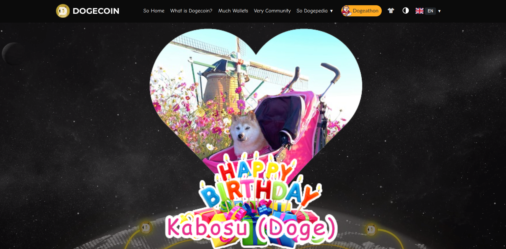

Commencer par un tweet avec le crash du luna pour expliquer les risques.

# L'investissement

## Fonctionnement

Il y a 2 façons de se procurrer des crypromonnaies.

- Passer par un exchange qui met en relation direct les acheteurs et les vendeurs qui se mettent d'accord sur un prix avant de procéder à la transaction.

- Le plus simple est d'utiliser un broker, il ne met pas en relation les acheteurs et vendeurs. Il agit comme un intermediaire qui va faire les transaction sur un exchange à la place des utilisateurs. Le prix est fixé par le broker et il n'y a pas de negociations possibles.

### Maitriser son argent

Je ne vais pas donner des conseils pour optimiser vos investissement, le plus important est de vous renseigner par vous même (pas des forums ou Jean didier a dit que le dodgecoin c'est le futur, to the moon), savoir si elle à un avenir, un but et si l'équipe parait motivée et solide.

Si je peux vous donner un conseil simple :
N'investissez que ce que vous êtes prêt a perdre.

### Éviter les vols

Utiliser des plateformes de traiding implique de ne pas posséder sa propre cle privée (phrase d'une 15aine de mots pour s'identifier). Ils ont donc une base de données énorme remplie de seed, un paradis pour les hackeurs.
Il est donc plus intéressant de garder sa clé privée en achetant directement des crypros à des tiers. Il en va donc de votre responsabilité de ne pas perdre votre seed.

De plus si vous avez votre propre seed, il est moins probable qu'in hackeur vous attaque vous avec vos petits euros plutôt que des grosses entreprises qui ont des milliards dans leurs BD.

### Se renseigner

Regarder si vous trouvez un white paper, sa crédibilité, regarder le site si il parait sérieux.
